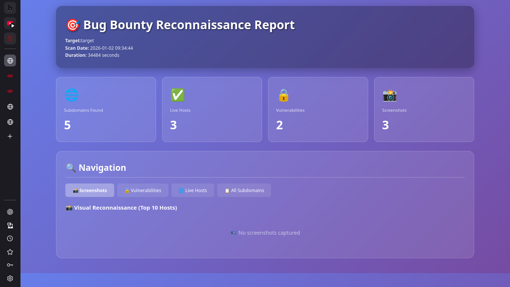

# recon

A professional, easy-to-use reconnaissance script for security assessments and bug bounty workflows. This repository contains the `recon.sh` script and supporting documentation to help you get started quickly and use the tool safely.

---

## Table of Contents

- [Overview](#overview)
- [Features](#features)
- [Requirements](#requirements)
- [Installation](#installation)
- [Usage](#usage)
- [Configuration](#configuration)
- [Contributing](#contributing)
- [Security & Responsible Disclosure](#security--responsible-disclosure)

---

## Overview

`recon` is a shell-based reconnaissance utility intended to streamline common information gathering tasks during security assessments and bug bounty reconnaissance.

This repository focuses on simplicity and composability: the script can be used standalone or integrated into a larger toolkit or CI pipeline.

## Features

- Concise, documented shell script (`recon.sh`) for common recon tasks
- Easy-to-use CLI pattern — run locally or in automation
- Minimal external dependencies

## Requirements

- Linux or macOS with Bash
- Common CLI tools (e.g., `curl`, `jq`, `dig`) depending on enabled features

> Tip: Run `bash -n recon.sh` to quickly validate script syntax before executing.

## Installation

1. Clone the repository:

```bash
git clone https://github.com/bekaa-crypto/recon.git
cd recon
```

2. Make the script executable:

```bash
chmod +x recon.sh
```

## Usage

Run the script directly from the repository root:

```bash
./recon.sh [options] <target>
```

Replace `[options]` and `<target>` with the appropriate flags and target hostname or IP address. Check the script header or use `./recon.sh -h` (if available) for a list of supported flags.

## Configuration

- Review and edit any configuration variables at the top of `recon.sh` before running in a production or sensitive environment.
- Use environment variables for secrets or API keys; avoid committing those to the repository.

## Contributing

Contributions are welcome. Please open a pull request with a clear description and tests or examples when applicable. For significant changes, open an issue first to discuss the planned work.

## Security & Responsible Disclosure

If you discover a security vulnerability, please contact the repository owner privately and provide sufficient detail to reproduce the issue. Do not publish details until a coordinated disclosure has occurred.

## Screenshots & UI

This project generates an interactive HTML dashboard (`dashboard.html`) as part of its recon output. Example screenshots are stored in the `screenshots/` directory and can be referenced in this repository.



> Tip: After running the script, open the generated dashboard in your browser to explore findings visually.
---

_Maintained by bekaa-crypto._
